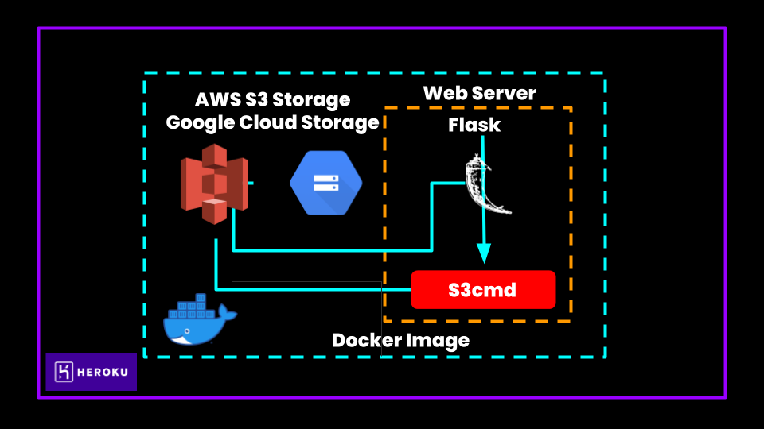

  

### ☀️ Description
This repository contains code that helps you build a web service to upload and download files from S3 bucket and Google Cloud Storage. It also helps you to deploy it to cloud as FaaS. Take a look at [setup.md](https://github.com/Sai-Adarsh/mtx-hacks/blob/master/docs/setup.md) to learn how to setup this project. You can also communicate with multiple SDKs to perform the same jobs .i.e., **AWS S3** and **Googe Cloud Storage**.

### ☀️ Functions

- **POST** - PUT files
    - `curl -X POST http://mtx-appendly.herokuapp.com/put_data -F "file=@sample.png" -F "bucket_name=mtx-appendly-test"`
- **POST** - PUT folders
    -  `curl -X POST http://mtx-appendly.herokuapp.com/put_dir -F "file=folder_1" -F "bucket_name=mtx-appendly-test"`
- **POST** - GET files
    -  `curl -X POST http://mtx-appendly.herokuapp.com/get_data -F "file=@sample.png" -F "bucket_name=mtx-appendly-test`
- **POST** - GET folders
    -  `curl -X POST http://mtx-appendly.herokuapp.com/get_dir -F "bucket_name=mtx-appendly-test/folder_1"`
- **POST** - Switch Config between AWS and GCP
    -  `curl -X POST http://mtx-appendly.herokuapp.com/switch_config -F "base=AWS"`
- **POST** - List all buckets
    -  `curl -X POST http://mtx-appendly.herokuapp.com/list_buckets`

You can also import the provided Postman Collection to take a quick look at the exposed endpoints. Also make sure to fill up `access_key` and `secret_key` environment variables to make endpoints intract with the deployed API.

### ☀️ Architecture

  

