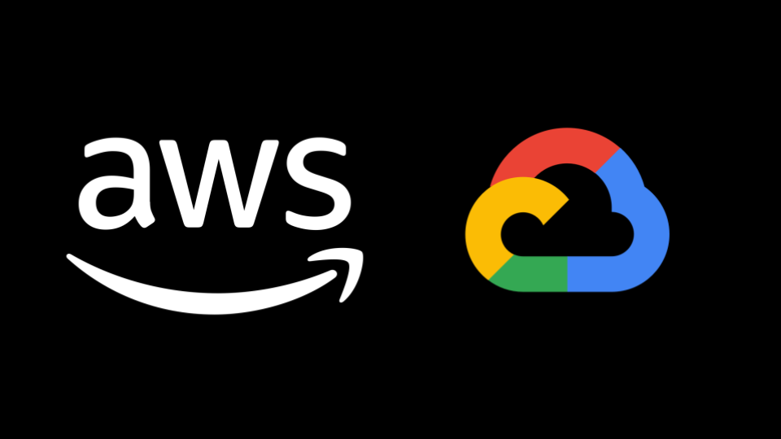
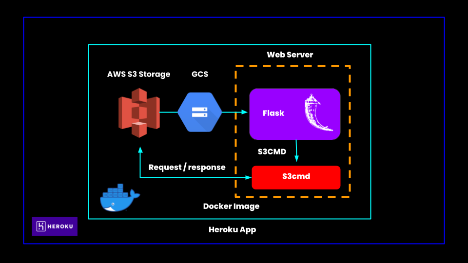

<p align="center">
  
</p>

### Description
This repository contains code that helps you build a web service and helps you deploy it to cloud as FaaS .i.e., Wrapper API for AWS S3 and Google Cloud Storage. Take a look at [setup.md](https://github.com/Sai-Adarsh/mtx-hacks/blob/master/docs/setup.md) to learn how to setup this project. You can also communicate with multiple SDKs to perform the same jobs .i.e., **AWS S3** and **Googe Cloud Storage**.

### Functions

- **POST** - PUT files
    - `https://{{apiId}}.execute-api.us-east-1.amazonaws.com/dev/user`
- **POST** - PUT folders
    -  `https://{{apiId}}.execute-api.us-east-1.amazonaws.com/dev/tweet`
- **POST** - GET foles
    -  `https://{{apiId}}.execute-api.us-east-1.amazonaws.com/dev/tweet`
- **POST** - GET folder
    -  `https://{{apiId}}.execute-api.us-east-1.amazonaws.com/dev/tweet/specific/{authType}/{userId}`
- **PATCH** - Switch Config between AWS and GCP
    -  `https://{{apiId}}.execute-api.us-east-1.amazonaws.com/dev/tweet/{tweetId}`
- **PATCH** - List all buckets
    -  `https://{{apiId}}.execute-api.us-east-1.amazonaws.com/dev/user`

You can also import the provided Postman Collection to take a quick look at the exposed endpoints. Also make sure to fill up `apiId` and `authToken` environment variables to make endpoints intract with the deplpoyed serverless application.

### Run

* Build the Image:
  ```bash
  $ docker build -t simple-flask-app:latest .
  ```
* Run the Docker container using the command shown below.
  ```bash
  $ docker run -d -p 5000:5000 simple-flask-app
  ```
* The application will be accessible at `http://127.0.0.1:5000` or if you are using `boot2docker`, fin IP address using `$ boot2docker ip` and the use the ip `http://<host_ip>:5000`


**Screenshots**<br />


### Architecture

<p align="center">
  
</p>
